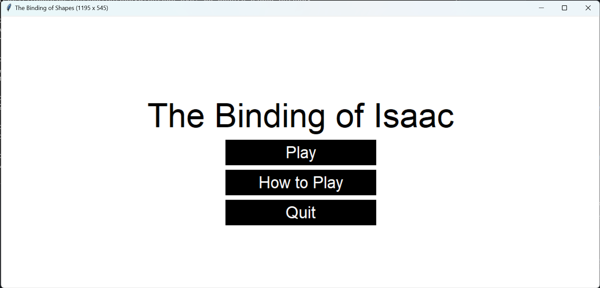
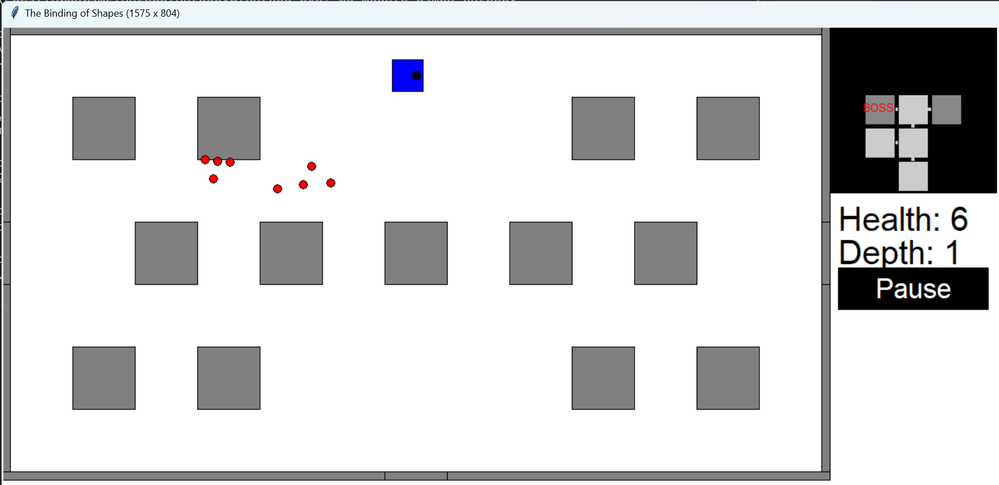
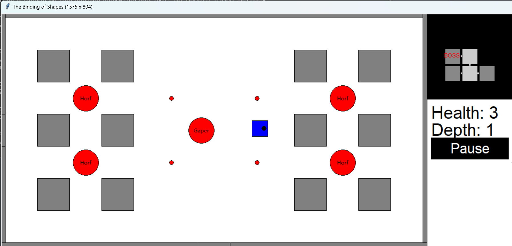

# The Binding of Shapes

A 2D roguelike shooter that is inspired by The Binding of Isaac. It would include randomly generated floors that the player can navigate and monsters for the player to fight against.

To play the game, run the main.py file. No libraries needs to be installed.

This game was made for the CMU CS 15-112 course.

